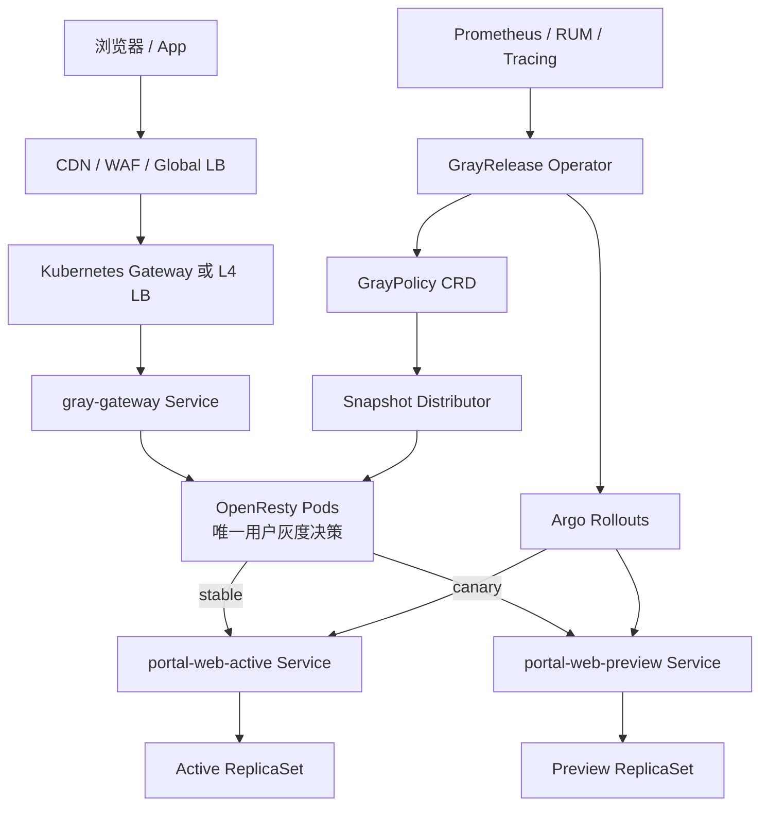
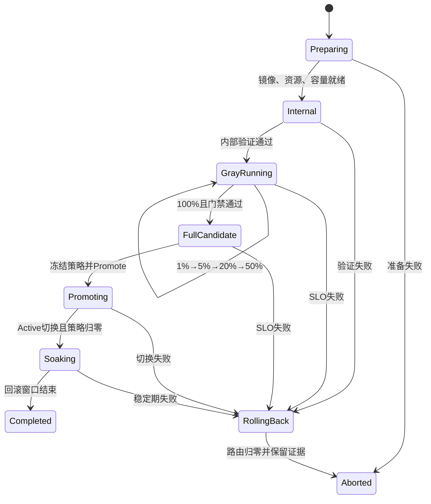

可以。生产方案建议正式定为：

> `Gateway/LB → OpenResty 灰度网关集群 → Active/Preview Service → Argo Rollouts ReplicaSet`

其中 OpenResty 是唯一“用户版本分流点”；Argo Rollouts 负责版本生命周期、服务选择器、分析和回滚，但不再按权重做第二次流量分配。

## 一、总体架构



职责必须严格拆分：

| 组件                 | 负责                                                         | 明确禁止                 |
| ------------------ | ---------------------------------------------------------- | -------------------- |
| CDN/WAF            | 安全、静态资源、地域流量                                               | 独立计算一次灰度版本           |
| Gateway/LB         | 把流量均衡到 OpenResty Pod                                       | Stable/Canary 权重     |
| OpenResty          | 用户身份、确定性分桶、版本租约                                            | 请求路径查询 Redis/K8s API |
| Kubernetes Service | 版本池内 Pod 负载均衡                                              | 决定用户属于哪个版本           |
| Argo Rollouts      | ReplicaSet、Active/Preview Service selector、Promotion/Abort | 再执行入口流量权重            |
| Gray Operator      | 发布状态机、容量门禁、策略分发、自动回滚                                       | 参与实际请求转发             |
| Prometheus/RUM     | 灰度质量判断                                                     | 指标未知时默认通过            |

Kubernetes 已将 Ingress API 冻结，新架构更适合采用 Gateway API；但 HTTPRoute 在本方案中只能指向一个 OpenResty backend，不能利用 `backendRefs.weight` 再切一次 Stable/Canary。[Kubernetes Ingress](https://kubernetes.io/docs/concepts/services-networking/ingress/)、[Gateway API HTTPRoute](https://gateway-api.sigs.k8s.io/reference/api-types/httproute/)

## 二、为什么推荐 Argo Blue/Green，而不是 Canary setWeight

推荐：

```yaml
strategy:
  blueGreen:
    activeService: portal-web-active
    previewService: portal-web-preview
    autoPromotionEnabled: false
```

运行关系：

* `activeService` 始终指向当前稳定版本。
* `previewService` 指向新 ReplicaSet。
* OpenResty 将灰度用户送到 preview。
* 达到 100% 且指标通过后，Argo 才把 active Service 原子切换到新版本。
* 切换完成后，灰度策略归一化为“新版本 Stable、Canary 0%”。

Argo 官方 Canary 在不使用 traffic router 时，会通过调整新旧 ReplicaSet 数量近似 `setWeight`；使用 traffic router 后，又会增加一个请求权重决策层。这两种方式都会和 OpenResty 的“按用户稳定分桶”发生冲突。[Argo Canary](https://argo-rollouts.readthedocs.io/en/stable/features/canary/)

Argo Blue/Green 原生管理 Active/Preview Service selector、预发布分析和切换后的旧 ReplicaSet 保留，非常适合当前模型。[Argo Blue/Green](https://argo-rollouts.readthedocs.io/en/stable/features/bluegreen/)

不建议第一版开发 Argo Gateway API Traffic Router 插件，因为官方插件机制目前仍标注为 Alpha。[Argo Traffic Router 插件](https://argo-rollouts.readthedocs.io/en/stable/features/traffic-management/plugins/)

## 三、K8s 组件和 Namespace

| Namespace         | 组件                                                   |
| ----------------- | ---------------------------------------------------- |
| `edge-system`     | Gateway、HTTPRoute、OpenResty Deployment、HPA、PDB       |
| `gray-system`     | Gray Operator、Snapshot Distributor、Admission Webhook |
| `web-prod`        | 业务 Rollout、Active/Preview Service、HPA、PDB            |
| `argo-rollouts`   | Argo Rollouts Controller                             |
| `observability`   | Prometheus、Alertmanager、Grafana、日志、Tracing、RUM       |
| `security-system` | 密钥管理、证书、镜像策略、审计                                      |

3 AZ 的建议基线：

| 组件                       |           副本基线 | 分布                 |
| ------------------------ | -------------: | ------------------ |
| OpenResty Gateway        |              6 | 每 AZ 至少 2          |
| Active 前端                |  按 100% 峰值容量计算 | 每 AZ 至少 2          |
| Preview 前端               | 最少 3；高比例前扩至全容量 | 每 AZ 至少 1          |
| Gray Operator            |              3 | Leader Election    |
| Snapshot Distributor     |              3 | 无状态跨 AZ            |
| Argo Rollouts Controller |             2+ | HA/Leader Election |

## 四、数据面请求链路

一次请求的完整决策顺序应为：

1. `/assets/`、健康检查、管理路径等特殊路径先分离。
2. 删除客户端提交的 `X-Canary`、`X-Release-ID`、`X-Gray-*`、`X-User-ID`。
3. 检查全局 Kill Switch。
4. 验证 Canary Service、Endpoint 和容量状态。
5. 验证内部 QA 短期签名令牌。
6. 验证已有 `gray_lease`。
7. 获取可信主体 ID。
8. 执行确定性万分桶。
9. 设置内部 `X-Release-Channel` 和 `X-Release-ID`。
10. 转发到 Active 或 Preview ClusterIP Service。
11. Kubernetes Service 在该版本的 Ready Pod 中负载均衡。

主体 ID 优先级：

```text
认证网关验证的 user_id
→ 服务端生成并签名的 gray_id Cookie
→ 最后才使用可信代理还原的客户端 IP
```

分桶协议建议固定为：

```text
bucket = uint64(
    HMAC-SHA256(
        hash_key,
        application + "|" +
        release_salt + "|" +
        normalized_subject_id
    )
) % 10000

canary = bucket < basis_points
```

要求：

* 同一次发布期间不修改 `release_salt`。
* 所有 OpenResty Pod 使用相同算法版本、Key 和测试向量。
* Cookie 使用 `__Host-gray_id`、`Secure`、`HttpOnly`、`SameSite=Lax`。
* 登录前后如需保持版本不变，使用短期签名 `gray_lease`。
* 原始用户 ID、Cookie 和令牌不得进入日志。

## 五、GrayPolicy 与 GrayRelease CRD

### GrayPolicy

GrayPolicy 表达当前生效的路由策略，不再只是一个 Redis 比例值：

```yaml
apiVersion: delivery.example.io/v1alpha1
kind: GrayPolicy
metadata:
  name: portal-web
  namespace: web-prod
spec:
  application: portal-web

  route:
    host: www.example.com
    pathPrefix: /

  targets:
    stable:
      serviceRef:
        name: portal-web-active
        port: 8080
      releaseId: web-20260801.3

    canary:
      serviceRef:
        name: portal-web-preview
        port: 8080
      releaseId: web-20260804.1

  allocation:
    basisPoints: 500
    algorithm: hmac-sha256-v1
    hashKeyId: gray-key-2026-q3
    releaseSalt: portal-web-20260804.1

  identity:
    trustedUserHeader: X-Authenticated-Subject
    deviceCookie: __Host-gray_id
    leaseCookie: __Host-gray_lease

  activation:
    effectiveAt: "2026-08-05T02:00:00Z"
    expiresAt: "2026-08-06T02:00:00Z"

  failurePolicy:
    coldStart: NotReady
    configSourceFailure: LastKnownGood
    canaryUnavailable: Stable
    killSwitch: false
```

Status 至少包含：

```yaml
status:
  observedGeneration: 8
  policyRevision: 184
  snapshotDigest: sha256:...
  effectiveBasisPoints: 500
  acknowledgedGateways: 6
  expectedGateways: 6
  stableReadyEndpoints: 12
  canaryReadyEndpoints: 6
  phase: Active
  conditions: []
```

### GrayRelease

GrayRelease 描述一次完整发布：

```yaml
apiVersion: delivery.example.io/v1alpha1
kind: GrayRelease
metadata:
  name: portal-web-20260804
  namespace: web-prod
spec:
  rolloutRef:
    name: portal-web

  policyRef:
    name: portal-web

  candidate:
    image: registry.example.com/portal-web@sha256:...
    releaseId: web-20260804.1
    assetsManifest: s3://web-assets/web-20260804.1/manifest.json

  steps:
    - basisPoints: 0
      audience: internal
      minimumDuration: 5m
      analysisTemplate: portal-smoke

    - basisPoints: 100
      minimumDuration: 10m
      analysisTemplate: portal-slo

    - basisPoints: 500
      minimumDuration: 15m
      analysisTemplate: portal-slo

    - basisPoints: 2000
      minimumDuration: 20m
      analysisTemplate: portal-slo

    - basisPoints: 5000
      minimumDuration: 30m
      manualApproval: true

    - basisPoints: 10000
      minimumDuration: 30m
      manualApproval: true

  promotion:
    requireAllGatewayAck: true
    rollbackWindow: 30m
```

Admission Webhook 应额外限制：

* 同一 `host + pathPrefix` 只能有一个活动策略。
* 同一应用只能有一个进行中的 GrayRelease。
* Active/Preview Service 必须存在且 release ID 匹配。
* Canary 放量前必须跨 AZ Ready。
* 比例增加前必须通过容量门禁。
* 高比例必须具备审批记录。
* `releaseSalt` 在同一发布中不可变。
* Stable 与 Canary 不能意外指向同一旧版本。
* Service 引用只能位于允许的 namespace。

## 六、配置分发：CRD 是事实源，Redis 降级为可选缓存

当前方案里 Redis 是事实源，而且请求缓存失效时同步访问 Redis。K8s 化后应调整为：

```text
GitOps / 发布 API
→ GrayPolicy CRD
→ Gray Operator 编译签名 Snapshot
→ Snapshot Distributor
→ 每个 OpenResty Pod 的 config-sync sidecar
→ Pod 内 Unix Socket / Loopback Admin API
→ ngx.shared.DICT
```

Redis可以保留，但只能用于：

* Snapshot 缓存；
* Pub/Sub 快速通知；
* 分布式锁；
* 控制台查询加速。

Redis不再承担：

* 唯一事实源；
* 请求路径读取；
* 直接 `redis-cli SET ratio`；
* 单节点 Shared Dict 更新。

Snapshot 应是一个不可拆分对象：

```json
{
  "schemaVersion": 1,
  "revision": 184,
  "application": "portal-web",
  "stableService": "portal-web-active.web-prod.svc.cluster.local",
  "canaryService": "portal-web-preview.web-prod.svc.cluster.local",
  "stableRelease": "web-20260801.3",
  "canaryRelease": "web-20260804.1",
  "basisPoints": 500,
  "algorithm": "hmac-sha256-v1",
  "hashKeyId": "gray-key-2026-q3",
  "releaseSalt": "portal-web-20260804.1",
  "effectiveAt": "2026-08-05T02:00:00Z",
  "digest": "sha256:...",
  "signature": "..."
}
```

Shared Dict 更新必须原子化：

```text
写 snapshot:<revision> = 完整 Snapshot
→ 校验读取及签名
→ 最后更新 active_revision
```

不能逐字段覆盖，否则请求可能同时看到“新比例 + 旧 Service”。

故障行为：

| 故障                     | 数据面行为                      |
| ---------------------- | -------------------------- |
| Distributor 暂时不可用      | 继续使用 Last Known Good       |
| Redis 故障               | 请求无感，冻结发布                  |
| Kubernetes API/Argo 故障 | 现有流量继续，停止晋级                |
| 新 Pod 没有有效 Snapshot    | Readiness 失败               |
| Snapshot 签名错误          | 拒绝安装并告警                    |
| Revision 倒退            | 拒绝覆盖                       |
| 单个 Gateway 未 ACK       | 先将其移出 Ready Endpoint，再允许激活 |
| 指标系统无数据                | 发布暂停，不视为成功                 |

现有 Gateway Pod 不应因为短暂控制面断连立即 NotReady，否则控制面故障会放大为入口容量故障；只有冷启动且无 LKG 的 Pod 不能接流量。

## 七、Argo Rollout 核心清单

```yaml
apiVersion: argoproj.io/v1alpha1
kind: Rollout
metadata:
  name: portal-web
  namespace: web-prod
spec:
  replicas: 12
  revisionHistoryLimit: 5

  rollbackWindow:
    revisions: 3

  selector:
    matchLabels:
      app.kubernetes.io/name: portal-web

  strategy:
    blueGreen:
      activeService: portal-web-active
      previewService: portal-web-preview
      autoPromotionEnabled: false

      activeMetadata:
        labels:
          delivery-role: active

      previewMetadata:
        labels:
          delivery-role: preview

      # 保留旧版本，覆盖配置传播、连接排空和快速回滚窗口。
      scaleDownDelaySeconds: 1800
      scaleDownDelayRevisionLimit: 2
      abortScaleDownDelaySeconds: 900

      prePromotionAnalysis:
        templates:
          - templateName: portal-smoke

  template:
    metadata:
      labels:
        app.kubernetes.io/name: portal-web

    spec:
      terminationGracePeriodSeconds: 120

      topologySpreadConstraints:
        - maxSkew: 1
          topologyKey: topology.kubernetes.io/zone
          whenUnsatisfiable: DoNotSchedule
          labelSelector:
            matchLabels:
              app.kubernetes.io/name: portal-web

        - maxSkew: 1
          topologyKey: kubernetes.io/hostname
          whenUnsatisfiable: ScheduleAnyway
          labelSelector:
            matchLabels:
              app.kubernetes.io/name: portal-web

      containers:
        - name: frontend
          image: registry.example.com/portal-web@sha256:REPLACE_ME

          ports:
            - name: http
              containerPort: 8080

          env:
            - name: RELEASE_ID
              value: web-20260804.1

          resources:
            requests:
              cpu: 500m
              memory: 512Mi
            limits:
              memory: 1Gi

          startupProbe:
            httpGet:
              path: /health/startup
              port: http
            periodSeconds: 5
            failureThreshold: 60

          readinessProbe:
            httpGet:
              path: /health/ready
              port: http
            periodSeconds: 5
            failureThreshold: 2

          livenessProbe:
            httpGet:
              path: /health/live
              port: http
            periodSeconds: 10
            failureThreshold: 3

          lifecycle:
            preStop:
              httpGet:
                path: /health/drain
                port: http
```

Active/Preview Service 均为内部 ClusterIP：

```yaml
apiVersion: v1
kind: Service
metadata:
  name: portal-web-active
  namespace: web-prod
spec:
  sessionAffinity: None
  selector:
    app.kubernetes.io/name: portal-web
  ports:
    - name: http
      port: 8080
      targetPort: http
---
apiVersion: v1
kind: Service
metadata:
  name: portal-web-preview
  namespace: web-prod
spec:
  sessionAffinity: None
  selector:
    app.kubernetes.io/name: portal-web
  ports:
    - name: http
      port: 8080
      targetPort: http
```

Argo 会在 selector 中维护对应的 `rollouts-pod-template-hash`。

一个重要约束是：不能在上一个 Preview 尚未完成时启动第二个候选版本。Argo 会让 Preview Service 指向“最新”ReplicaSet，因此 GrayRelease Operator 必须强制单应用串行发布，并校验 Preview Endpoint 的 `release_id`。

## 八、OpenResty 集群

OpenResty Deployment 至少需要：

```yaml
spec:
  replicas: 6

  strategy:
    type: RollingUpdate
    rollingUpdate:
      maxUnavailable: 0
      maxSurge: 2

  template:
    spec:
      automountServiceAccountToken: false
      terminationGracePeriodSeconds: 180

      containers:
        - name: openresty
          # Lua 数据面
        - name: gray-config-sync
          # Snapshot 验签、ACK、重试和本地安装
```

OpenResty 探针语义：

| 探针           | 检查                                            |
| ------------ | --------------------------------------------- |
| Startup      | 进程启动，并至少加载一个有效 Snapshot                       |
| Liveness     | Worker 事件循环正常，不检查 Redis、Prometheus或后端         |
| Readiness    | 非 draining、有可用 Stable、已安装有效策略                 |
| Canary Ready | 不是 OpenResty Pod Ready 条件，而是 GrayRelease 放量门禁 |

核心 upstream：

```nginx
map $gray_target $frontend_upstream {
    default portal_active;
    canary portal_preview;
}

upstream portal_active {
    zone portal_active 64k;
    server portal-web-active.web-prod.svc.cluster.local:8080;
    keepalive 256;
}

upstream portal_preview {
    zone portal_preview 64k;
    server portal-web-preview.web-prod.svc.cluster.local:8080;
    keepalive 256;
}
```

Gateway API 的 HTTPRoute 只指向 OpenResty：

```yaml
apiVersion: gateway.networking.k8s.io/v1
kind: HTTPRoute
metadata:
  name: portal-web
  namespace: edge-system
spec:
  parentRefs:
    - name: public-gateway

  hostnames:
    - www.example.com

  rules:
    - filters:
        - type: RequestHeaderModifier
          requestHeaderModifier:
            remove:
              - X-Canary
              - X-Release-Channel
              - X-Release-ID
              - X-Authenticated-Subject

      backendRefs:
        - name: gray-gateway
          port: 80
```

认证网关如需提供用户 ID，必须在清洗客户端 Header 后重新注入可信值。Gateway API 支持请求 Header 修改，但仍需核对具体 Gateway 实现的兼容性。[Gateway API Header Modifier](https://gateway-api.sigs.k8s.io/guides/user-guides/http-header-modifier/)

## 九、HPA、容量与回滚能力

OpenResty 和业务 Rollout必须使用独立 HPA。

OpenResty HPA指标：

* CPU；
* RPS；
* active connections；
* event-loop latency；
* WebSocket 连接数；
* pending requests。

业务 HPA指标：

* CPU；
* 每 Pod RPS；
* inflight requests；
* SSR 渲染队列；
* WebSocket 连接；
* 下游连接池水位。

Blue/Green 下，如果不设置 `previewReplicaCount`，HPA 对 Rollout 的期望副本会同时应用到 Active 和 Preview，因此两个版本都保持完整容量；这会增加成本，但提供最可靠的放量和回滚能力。[Argo Rollouts HPA](https://argo-rollouts.readthedocs.io/en/stable/features/hpa-support/)

推荐第一版采用完整双容量：

```text
Active：可承接 100% 峰值流量
Preview：公开灰度前预扩至下一阶段容量
50% 以后：Preview 必须具备 100% 安全容量
Promotion 完成且回滚窗口结束前：Active 旧版本不缩容
```

不能以用户比例直接计算容量，因为 20% 用户可能贡献 60% 请求。容量门禁必须使用实际 QPS、并发和长连接数：

```text
Preview 安全容量
>= 下一阶段预计实际请求量 × 峰值系数 × 1.3 安全余量
```

如果灰度持续数天或双份全容量成本不可接受，应改成两个独立工作负载：

```text
portal-web-stable Deployment/Rollout + 独立 HPA
portal-web-canary Deployment/Rollout + 独立 HPA
```

长期 A/B 实验也应采用特性开关或实验平台，而不是长期占用 Argo Blue/Green。Argo 官方同样建议 Rollout 更适合短时渐进发布。[Argo Rollouts 最佳实践](https://argo-rollouts.readthedocs.io/en/stable/best-practices/)

## 十、PDB、多 AZ 与排空

建议：

* OpenResty：6 Pod，PDB `minAvailable: 4`。
* Active 和 Preview 分别创建 PDB。
* Preview 即使只有 1% 流量，也至少跨 3 AZ 运行 3 Pod。
* 使用 `topology.kubernetes.io/zone` 和 `kubernetes.io/hostname` 两层 spread。
* `preStop` 先进入 draining，再等待 EndpointSlice 和连接排空。
* `terminationGracePeriodSeconds` 覆盖最大在途请求。
* WebSocket 必须设置最大连接生命周期，否则旧 ReplicaSet无法在有限时间内退出。

PDB只约束通过 Eviction API 发生的自愿中断，无法保护节点宕机或 AZ 故障；真正的容灾仍依赖副本数、故障域分布和容量。[Kubernetes Pod Disruption](https://kubernetes.io/docs/concepts/workloads/pods/disruptions/)、[Topology Spread](https://kubernetes.io/docs/concepts/scheduling-eviction/topology-spread-constraints/)

## 十一、前端资源、API 和 WebSocket

### HTML 与静态资源

```text
HTML / SSR
→ OpenResty 灰度
→ private, no-store

/assets/<release-id>/<content-hash>.js
→ 对象存储 + CDN
→ public, max-age=31536000, immutable
```

发布顺序：

1. 上传所有静态资源。
2. 验证 manifest 中每个 Chunk。
3. CDN 预热核心 JS/CSS。
4. 启动 Preview Pod。
5. Preview Readiness 验证资源 manifest。
6. 内部流量验证。
7. GrayPolicy 才允许从 0% 提升。

必须避免：

* Canary HTML 填充公共 CDN 缓存。
* `/assets/` 404 fallback 到 `index.html`。
* 发布过程中覆盖旧资源。
* Rollback 窗口结束前删除旧 Chunk。
* Service Worker 立即删除旧 Cache。
* Chunk 失败后无限刷新。

### API

前端和 API 必须采用以下二选一：

* V1/V2 共用向后兼容 API；
* OpenResty把可信 `X-Release-Channel` 传给 API 网关，由 API 路由到同版本服务。

禁止 Canary 请求失败后透明重试到 Stable，尤其是 POST/PATCH 等非幂等请求。关键写入必须使用 Idempotency Key 和服务端去重。

数据库采用 expand-contract：

```text
先扩展兼容字段
→ V1/V2 双写或兼容读
→ 前端灰度
→ V2 稳定并过回滚窗口
→ 最后清理旧字段
```

### WebSocket

* 只在 Upgrade 握手时决定版本。
* 建立连接后不重新分桶。
* 使用同一个 `gray_id/gray_lease`。
* HPA观察连接数而不只看 CPU。
* 回滚先停止新连接进入 Preview，再排空已有连接。
* 必要时发送 Close 1012，并让客户端随机延迟重连。
* 禁止直接杀掉全部 Canary Pod引发重连风暴。

## 十二、发布状态机



每一步放量：

```text
检查静态资源
→ 检查 Preview Endpoint 和跨 AZ 分布
→ 预扩容量
→ 生成新 policy_revision
→ 分发 Snapshot
→ 所有 Ready Gateway ACK
→ 到 effectiveAt 激活
→ 观察最小时长
→ AnalysisRun 判断
→ 下一阶段或回滚
```

Promotion顺序：

1. GrayPolicy 达到 100%。
2. 所有 Ready OpenResty ACK。
3. 指标门禁通过。
4. 冻结新的 GrayPolicy 更新。
5. 调用 Argo Promote。
6. 等待 Active Service 全部指向新 ReplicaSet。
7. 发布新策略：新版本成为 Stable，Canary 归 0%。
8. 所有 Gateway ACK。
9. 进入稳定观察期。
10. 回滚窗口结束后才缩容旧 ReplicaSet。

Rollback顺序必须反过来：

1. 先生成更高 Revision 的 0% 策略。
2. 等待 Gateway ACK。
3. 新请求全部回 Active。
4. 开始 WebSocket 排空。
5. 再执行 Argo Abort/Undo。
6. 保留 Preview Pod一段时间采集证据。
7. 不删除新版本静态资源。

绝不能先缩容 Preview，再更新路由。

## 十三、监控与自动回滚

每个请求需要记录：

```text
request_id
trace_id
application
policy_revision
stable_release_id
canary_release_id
selected_channel
decision_reason
subject_source
upstream_service
HTTP status
upstream latency
config_age
```

不记录原始 subject ID。

按版本对比：

* QPS、5xx、超时、p95/p99；
* JS error、白屏、Chunk 404；
* LCP、INP、CLS；
* 登录、支付、提交成功率；
* WebSocket 握手、异常断开和重连；
* ready endpoint、Pod restart、CPU throttle；
* 实际用户曝光比例与实际请求比例；
* Gateway policy revision 收敛率。

门禁示例需要根据你们 SLO 调整：

```text
最小样本：>= 1000 请求
Canary 5xx：< 1%
Canary 与 Stable 5xx 差值：< 0.3 个百分点
Canary p95：<= Stable p95 × 1.2
JS Error 增量：< 0.2 个百分点
Chunk 404：无显著增长
Gateway Revision ACK：100%
Preview 容量余量：>= 30%
```

AnalysisRun 的结果应为：

* Successful：继续。
* Failed：回滚。
* Inconclusive/无数据：暂停。

Argo AnalysisRun原生支持成功、失败和不确定状态，并可通过 Prometheus 查询驱动发布。[Argo Analysis](https://argo-rollouts.readthedocs.io/en/stable/features/analysis/)

## 十四、安全边界

必须实现：

* Gateway/WAF删除外部灰度和身份 Header。
* 内部认证网关重新注入可信主体。
* Gray Snapshot 使用签名和单调 Revision。
* Snapshot 私钥位于 KMS；Sidecar仅持验签公钥。
* 分桶 HMAC Key 通过 Secret/CSI 挂载并支持 Key ID 轮换。
* OpenResty `automountServiceAccountToken: false`。
* OpenResty无权读取或修改 Rollout、GrayPolicy。
* Operator使用最小化 RBAC。
* 管理 API 独立域名、mTLS/OIDC、MFA、审批和审计。
* NetworkPolicy限制 Gateway、Distributor、Active/Preview 之间的调用。
* 镜像使用 Digest并做签名校验。
* Redis若保留，必须 TLS、ACL、多 AZ，并禁止应用 Pod写入。
* 日志不输出 Cookie、令牌、用户 ID或签名材料。

## 十五、多集群扩展

Argo Rollouts 的作用域是单集群，多集群环境需要每个集群部署独立 Argo Controller，再由全局 GrayRelease 控制面协调发布波次。[Argo Rollouts 最佳实践](https://argo-rollouts.readthedocs.io/en/stable/best-practices/)

```text
Global LB
├── Region A Cluster → Gateway → OpenResty → Active/Preview
├── Region B Cluster → Gateway → OpenResty → Active/Preview
└── Region C Cluster → Gateway → OpenResty → Active/Preview
```

要求：

* 集群间使用相同分桶算法、salt 和 key ID。
* 每个集群独立 ACK policy revision。
* 只有已部署 Canary 版本的区域才允许进入 Canary。
* GSLB 故障切换前验证目标区域具备相同构建物。
* 先做区域级灰度，再做区域内用户灰度。
* 某区域不可用时，签名租约应允许安全回 Stable。
* 静态资源提前复制到所有可能接管流量的区域。

## 十六、建议落地顺序

1. 建立 Gateway/LB → OpenResty 集群 → Active/Preview Service。
2. 将静态资源迁移为 release/hash 不可变 CDN 模型。
3. 去除请求路径 Redis，加入 LKG。
4. 引入 config-sync sidecar、签名 Snapshot 和原子 revision。
5. 创建 GrayPolicy/GrayRelease CRD 与 Operator。
6. 将前端 Deployment迁移为 Argo Blue/Green Rollout。
7. 接入 HPA、PDB、Topology Spread和连接排空。
8. 接入 Prometheus、RUM、AnalysisRun和自动回滚。
9. 完成安全边界、RBAC、NetworkPolicy和密钥轮换。
10. 执行 Redis故障、AZ故障、配置分裂、非幂等重试和紧急回滚演练。
11. 最后再扩展多集群和长期双工作负载模式。

这套架构的最终验收标准是：

* 同一主体跨所有 OpenResty Pod的版本决策不一致数为 0。
* 任何时刻只有 OpenResty 一个组件决定 Stable/Canary。
* 控制面、Redis或Kubernetes API短暂故障不影响现有请求。
* 未同步策略的 Gateway Pod不会继续接收新流量。
* Active始终能在约定 RTO 内承接100%流量。
* 任一 AZ故障后，Active和Preview仍有健康 Endpoint。
* Stable用户获取Canary HTML的次数为0。
* 非幂等写请求跨版本重试次数为0。
* 自动回滚先切路由、后处理工作负载，顺序永远不反转。
